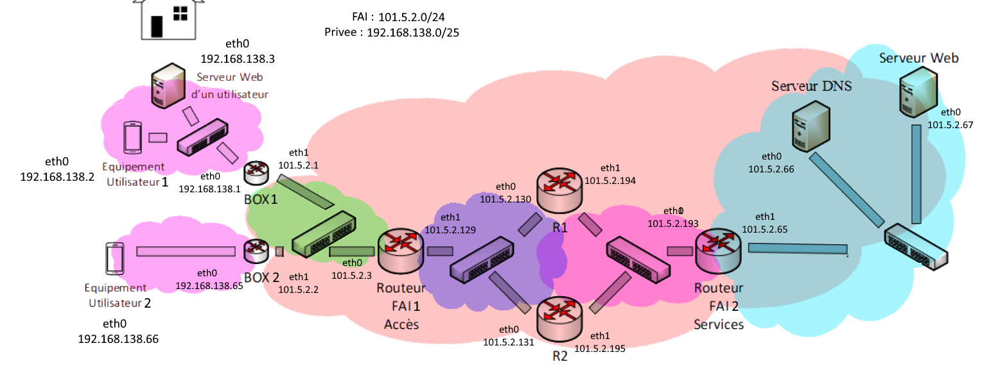

# Internet Project

## Introduction
This Git repository documents the steps I took to complete the Internet Project in Enseeiht. 

The project involved setting up a simulated network infrastructure, configuring routers, implementing routing protocols, and ensuring network security. The steps outlined below detail the process and provide an overview of the tasks I performed.

You can find the project's instructions here: [Internet Project Instructions](instruction.pdf)

## Project Steps

### 1. Getting Started with Virtualization Tools and Installation on My Machine
- In this first step, I familiarized myself with virtualization tools and installed them on my local machine. Tools like VirtualBox or VMware were used to create virtual network environments.

### 2. Creating the Network Architecture
- I designed the network architecture, including the placement of routers, switches, and client machines. The network topology was planned to meet the project requirements.

### 3. Setting up Addressing and Testing with Static Routing
- I assigned IP addresses to the various network components and tested connectivity using static routing. This step involved configuring static routes to ensure data could flow between different network segments.

**Image of the network architecture:**

### 4. Implementing Dynamic Routing between the ISP Routers Using RIP, Testing, and Visualization
- I implemented dynamic routing between the ISP routers using the RIP (Routing Information Protocol) routing protocol. This step allowed for automatic routing table updates and dynamic routing decisions. I also verified the functionality and visualized the routing process.

### 5. Configuring CPE Boxes and Private Networks, Testing, and Visualization
- The configuration of customer premises equipment (CPE) boxes and private networks was carried out by me in this step. The goal was to create secure, isolated private networks for customers, and the setup was tested and visualized.

### 6. Setting up the ISP's Web Service, Testing, and Visualization
- I set up a web service for the Internet Service Provider (ISP). This service hosted the ISP's website and was tested to ensure it was accessible.

### 7. Setting up the ISP's DNS Service, Testing, and Visualization
- The ISP's Domain Name System (DNS) service was configured by me to handle DNS resolution for clients. I tested the DNS service and visualized the resolution process.

### 8. Implementing DMZ Security
- I implemented security measures for the Demilitarized Zone (DMZ), such as firewall rules and intrusion detection systems, to protect the publicly accessible services. Security policies were established to ensure a secure DMZ.

### 9. Implementing Private Network Security
- Security measures were applied to the private network by me to protect against unauthorized access and data breaches. This included configuring firewalls, VPNs, and other security features.

### 10. Setting up the Client's Web Service and Accessing the Service from Another Client, Testing, and Visualization
- I set up a web service for a client and established access to this service from another client within the network. This step involved testing the accessibility of the client's web service and visualizing the connection.

## Conclusion
This Git project provides a comprehensive overview of the Internet Project's progression. The documented steps show the planning, configuration, and testing processes involved in creating a network infrastructure, providing services, and ensuring network security. Each step contributes to the overall goal of a functional and secure Internet service provider network.